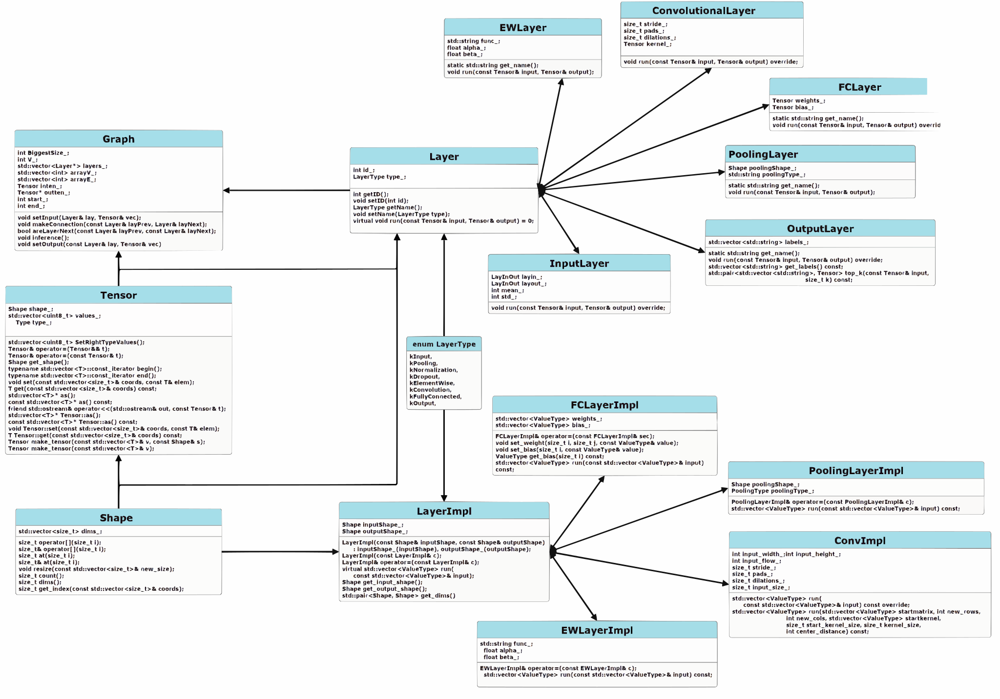

[](https://github.com/embedded-dev-research/itlab_2023/actions/workflows/ci.yml)
[](https://codecov.io/gh/embedded-dev-research/itlab_2023)

# AlexNet-MNIST-Inference
## Model Performance

<!--ACCURACY_PLACEHOLDER-->Accuracy: Stat: 98.01 (updated: 2025-04-27)<!--END_ACCURACY-->
## Short description
A lightweight C++ library for performing high-performance inference on MNIST handwritten digits using a modified AlexNet architecture. Designed for efficiency and educational purposes, this project demonstrates how classic CNNs can be optimized for small-scale tasks in native environments.
### Key Features:

* C++17 implementation for bare-metal performance

* Simplified AlexNet for 28×28 grayscale images

* Parallel computing via Intel OneTBB (Threading Building Blocks)

* Pre-trained model: AlexNet-model.h5 included
## **Some files used to create the library**
### Neural network models
You need to download [Alexnet-model.h5](https://github.com/moizahmed97/Convolutional-Neural-Net-Designer/blob/master/AlexNet-model.h5) to the folder *docs*

## **How do I launch the inference?**
* Make sure you install the project dependencies by running: *pip install -r requirements.txt*
* You need to run the script *parser.py* that is located in app/AlexNet to read weights from a model *Alexnet-model.h5* and the json file with the weights will be stored in the *docs* folder.
* Then put the test images in png format in the folder *docs/input*
* After building the project, which is described below, run Graph_build in folder *build/bin*

## **Building a Project**
### *Windows*
To build and run this project locally on Windows, follow these steps:

1. **Clone the repository:**  
   Clone this repository to your local machine using the following command:
   ```bash
   git clone https://github.com/embedded-dev-research/itlab_2023.git
   ```
2. **Update submodules:**
   Navigate to the project directory and update the submodules:
   ```bash
   git submodule update --init --recursive
3. **Configure the project:**
   Create a separate directory for configure the project and compile it:
   ```bash
   mkdir build
   cd build
   cmake .. -DCMAKE_BUILD_TYPE=Release
    ```
   If you want to build in a Debug, change the Release to Debug

   *Note: Make sure you have CMake installed to build the project.*
5. **Build the project:**
   Next, to build the project, we will need to enter the command
    ```bash
   cmake --build . --config Release
    ```
6. **Run the project**
   After building the project, you can find the executable file in the following path from the *build* folder
   ```bash
   cd build/bin
    ```
   and run the file
    ```bash
   Graph_Build.exe
    ```
### *Linux/macOS*
   To build and run this project locally on Linux or macOS, follow these steps:

1. **Clone the repository:**  
   Clone this repository to your local machine using the following command:
   ```bash
   git clone https://github.com/embedded-dev-research/itlab_2023.git
   ```
2. **Update submodules:**
   Navigate to the project directory and update the submodules:
   ```bash
   git submodule update --init --recursive
3. **Install necessary dependencies:**
   1. OpenMP
     Debian/Ubuntu:
     ```bash
     sudo apt-get install -y libomp-dev
     ```
     macOS:
     ```
     brew install libomp
     ```
4. **Configure the project:**
   Create a separate directory for configure the project and compile it:
   ```bash
   cmake -S . -B build
    ```
    *Note: Make sure you have CMake installed to build the project.*
   For macOS need to specify the path to omp.h file:
   ```bash
   cmake -S . -B build -DCMAKE_CXX_FLAGS="-I$(brew --prefix libomp)/include" -DCMAKE_C_FLAGS="-I$(brew --prefix libomp)/include"
   ```
5. **Build the project:**
   Next, to build the project, we will need to enter the command
    ```bash
   cmake --build build --config Release
    ```
    If you want to build in a Debug, change the Release to Debug
6. **Run the project**
   After building the project, you can find the executable file in the following path from the *build* folder
   ```bash
   cd build/bin
    ```
   and run the file
    ```bash
   ./Graph_Build
    ```

## Test Process
   This project contains tests to verify functionality.
   To test the project, the Google Test Framework is used as a submodule of the project.
   ### Google Test Framework

   Google Test is a powerful framework for unit testing in C++. In this project, Google Test is a submodule. When building the project, you have already       updated it, and it is ready for use.
   ### Running tests
   ### *Windows*
   
   To start the testing process locally, you need to go to the directory
   ```bash
   cd build/bin
   ```
   and run the following files:
   ```bash
   run_test.exe
   ```
### *Linux*
To start the testing process locally, you need to go to the directory
   ```bash
   cd build/bin
   ```
   and run the following files:
   ```bash
   chmod +x run_test
   ./run_test
   ```

## **Accuracy validation**
To run accuracy validation you need to use the MNIST dataset, which you can download [here](https://github.com/DeepTrackAI/MNIST_dataset/tree/main/mnist/test) and put it in a folder *docs/mnist/mnist/test*
Now you can run accuracy check - *build\bin\ACC_MNIST.exe*
* **The accuracy should be 98.02%**

## **Documentation of project**
https://github.com/embedded-dev-research/itlab_2023/blob/Semyon1104/Final_documentation/docs/IT_Lab_2023.pdf
## **Structure of our library**

